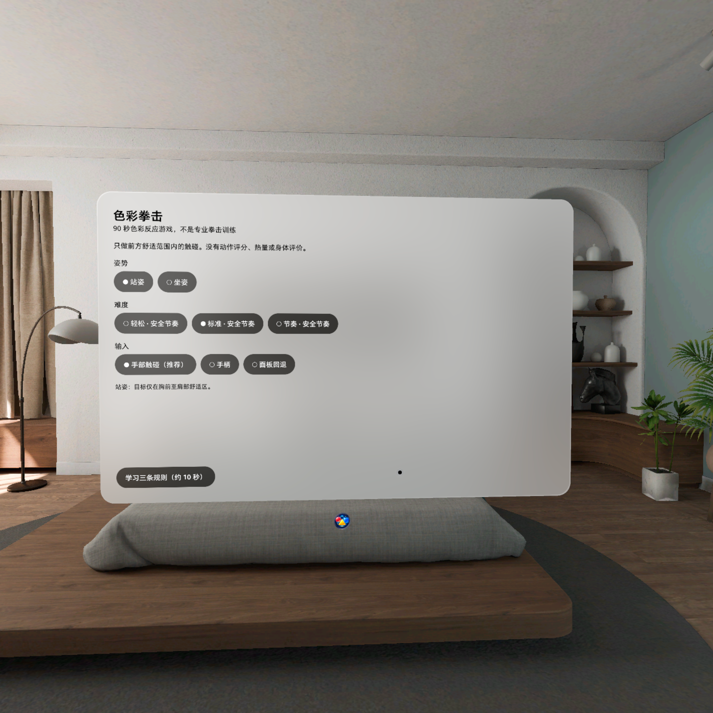

# 色彩拳击 Color Strike

面向 PICO Project Swan / PICO OS 6 的 90 秒中文色彩反应游戏。玩家按“红色圆形用左手、蓝色方形用右手、黄色三角用双手”的规则，在前方安全舒适区触碰目标并点亮霓虹连击。

> 本应用不是专业拳击训练，不提供动作评分、卡路里估算、运动处方或身体评价。



## 功能

- 站姿与坐姿两套安全区域参数
- 四套固定组合与每 30 秒递进的难度曲线
- 颜色、形状和手部图标三重提示
- PICO 手部追踪触碰，以及手柄/面板回退输入
- 校准、短教程、训练、暂停、重置、结算和本地历史记录
- 单手追踪丢失、双手不同步和输入切换反馈

## 技术栈

- Kotlin
- PICO Spatial SDK 6.0.0
- PICO SpatialUI / Jetpack Compose
- Android API 35
- Stage 空间应用

包名：`com.pico.swan.colorstrike`

## 构建

准备 Java 21、Android SDK 35 和 PICO Spatial SDK 后，在项目目录运行：

```powershell
gradle :app:testDebugUnitTest :app:assembleDebug
```

APK 输出位置：`app/build/outputs/apk/debug/app-debug.apk`。

## 输入说明

- 红色圆形：左手触碰；手柄回退使用左键。
- 蓝色方形：右手触碰；手柄回退使用右键。
- 黄色三角：双手同步触碰；手柄回退使用左右键组合。

目标只会生成在用户前方配置化舒适区内，并避开头部 30 厘米范围与过度伸手区域。
